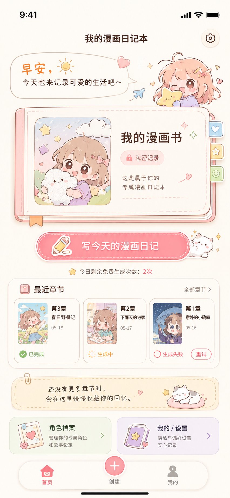

# 日记生成漫画



“日记生成漫画”是一个微信小程序项目，目标是把用户每天输入的日记、上传的照片、角色档案和情绪标签，生成一章 Q 版漫画。项目初版定位为私人日记漫画本，只服务个人记录、查看和私密分享，不做公开社区。

## 项目定位

- 每篇日记生成一个漫画章节。
- 每个用户初版只有一本默认漫画书。
- 每章允许上传 1-9 张照片。
- 用户可以随机生成页数，或自定义生成 1-8 张漫画图。
- 一张生成图表现为多格漫画分镜。
- 初版只提供 Q 版漫画风格。
- 日记原文属于隐私数据，默认不公开。

## MVP 范围

第一版聚焦完成私人漫画书的最小闭环：

- 微信登录。
- 默认漫画书。
- 角色档案维护。
- 日记章节创建。
- 照片上传记录。
- 异步漫画生成任务。
- 小程序轮询任务状态。
- Q 版漫画生成结果查看。
- 章节删除与重新生成。
- 章节私密分享。
- 免费次数控制。
- 简单敏感词过滤。

## 明确不做

初版不扩大到以下范围：

- 公开社区、广场、推荐流。
- 评论、点赞、关注。
- 整本书分享。
- 单张漫画图独立分享。
- 支付、订单、充值、会员、余额、支付回调。
- 复杂内容审核平台。
- 多种漫画风格切换。
- 复杂角色训练。
- 绑定具体 AI 图片生成供应商。

## 项目结构

```text
.
├── admin/        # 后台管理端
├── docs/         # 产品、接口、流程和 UI 原型文档
├── manhua-xcx/   # 微信小程序端
└── server/       # 后端服务
```

## 核心设计原则

- AI 生成能力通过可替换适配层接入，业务模块不直接依赖供应商原始字段。
- 角色档案参与每次生成提示词，用于约束主角形象一致性。
- 后端采用异步生成任务，小程序通过任务 ID 轮询状态。
- 分享页只展示用户允许分享的章节内容，不暴露其他章节、整本书或未授权原文。

## 本地开发

本地开发说明见 [docs/local-dev.md](docs/local-dev.md)。

更多产品边界和流程说明见：

- [docs/MVP_SCOPE.md](docs/MVP_SCOPE.md)
- [docs/PRD.md](docs/PRD.md)
- [docs/AI_GENERATION_FLOW.md](docs/AI_GENERATION_FLOW.md)
- [docs/backend-api.md](docs/backend-api.md)
